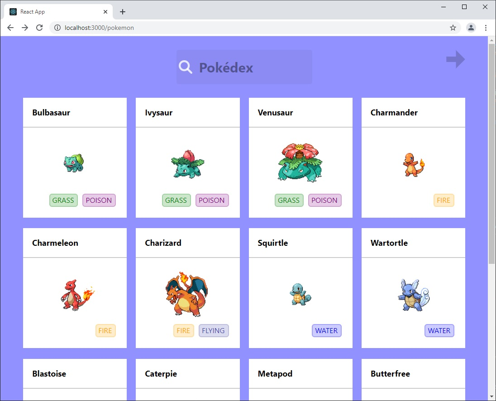
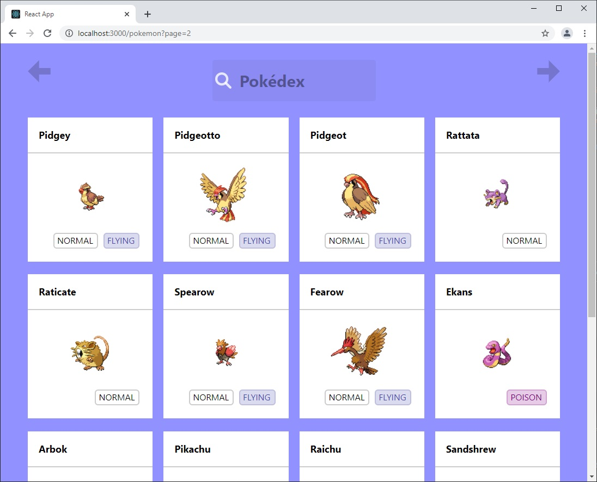
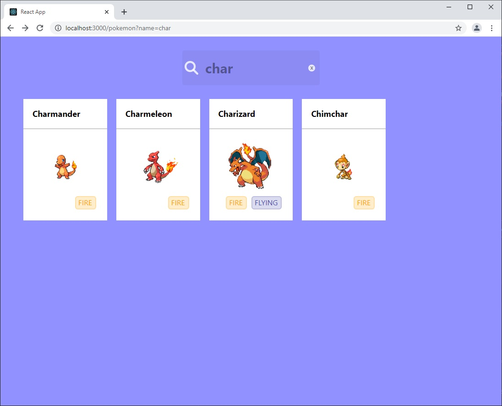
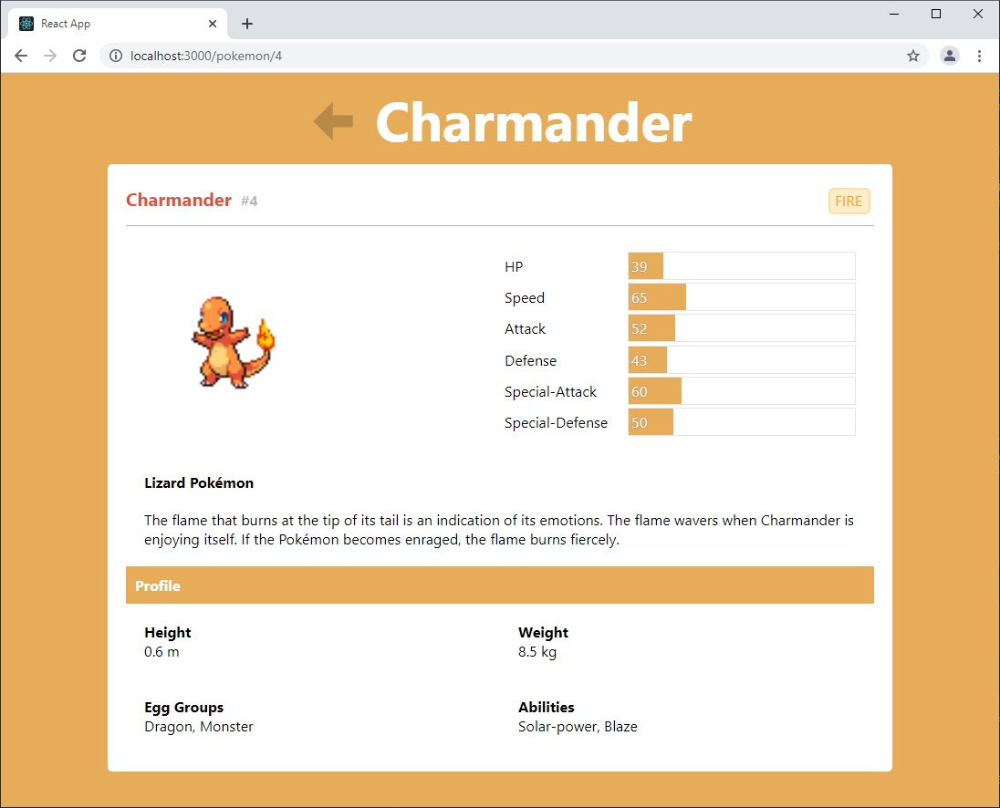
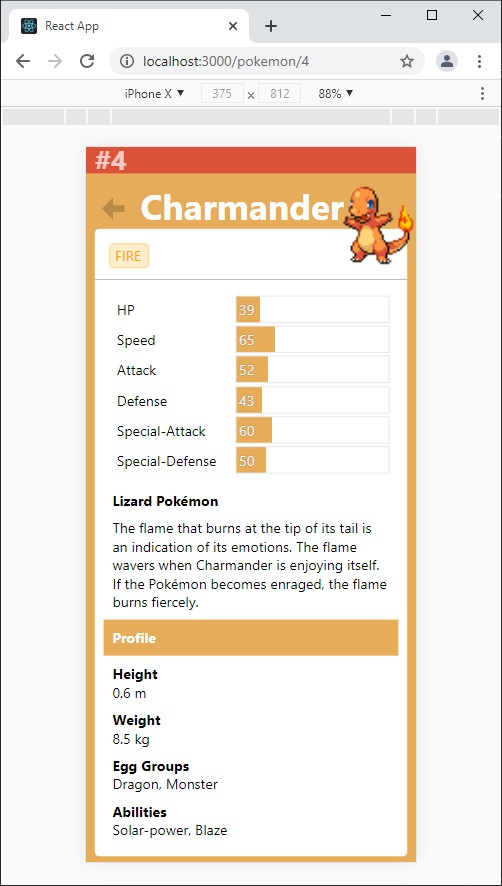
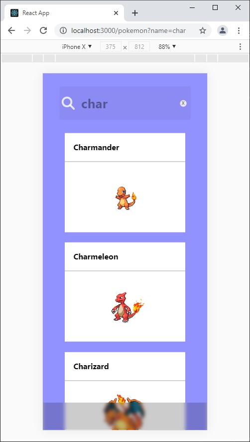
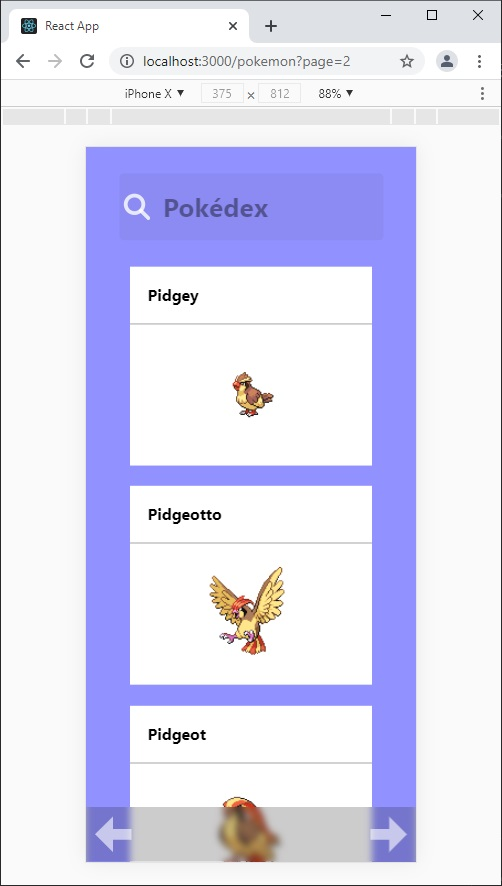

# PokeDex Demo Project

This project is a front-end skills demonstration to show my competency in front-end design and development. This project mainly is created using React and Typescript. Backend information, images, and UI specification were provided while all else was created from scratch.

## To run:
1. Install [node.js](https://nodejs.org/en/download/)
2. Install [git](https://git-scm.com/downloads)
3. Download repository: `git clone https://github.com/scottdrichards/pokedex`
4. Open folder: `cd ./pokedex`
5. Install packages: `npm install`
6. Run: `npm start`

## Comments:
- Sizes, layouts, and colors are not pixel-perfect accurate.
- The recommended colorthief library requires substantial dependencies (>1GB install) so I wrote my own basic one. Because of security/CORS, the script cannot read pixel data from images from other origins. This will generate an error in the browser and automatically fall back to a Google proxy with more permissive CORS policies.
  - This dominant color script just counts colors and does not do any form of clustering. This makes it rather innacurate for most images but is sufficient to demonstrate the effect of dynamic theming.
- The specification called for a back button in the detail page. This can have ambiguous behavior as to whether it should do the browser history back or go to the list page. I do not believe I back button is appropriate within a browser as it conflicts with the native back functionality and can be confusing to the user. I implemented it so that it goes back (browser history) if the previous session history item is in the same domain and otherwise is a dumb link to the list.
## Improvements
- The server API calls are rather slow. With such a small amount of data crossing paths, I think it would be better to grab the entire database and store it in the browser storage, then keep a connection open for updates should they come. This would ease the burden on the server from having so many requests and speed up page operations.
- Pagination is a presentation attribute. It would be better to have the client handle pagination. For example, the client could request a range of items to be returned by the server. The server could set a limit for how many items can be sent at a time.
- Images seem to have variable amount of whitespace.
- I could update the detail page to have hard-coded sizes for (most?) elements to prevent pop-in when the data loads.
- When doing a search, the pagination links returned do not include the search queries. As this is a server-side error, I did not correct it.
## Post-mortem
- I definitely spent too much time going down CSS rabbit holes and trying to satisfy HTML pedantry. For example, the HTML tag for `<meter>` is specifically designed for things like stats. However, styling such a meter is near impossible. I also tried to keep stylistic DOM elements to a minimum, pushing as much non-content features as possible to the stylesheet. While this does satisfy the original intent of HTML/CSS, it is near impossible to be pedandtic and make a modern web page.
  - I also made animations and styles that did not contribute to the overall project and ultimately removed them. For example, I made a pokeball animation that hides loading when a page is clicked. The animation was clunky and more of an annoyance than anything. I also made an animation that causes stats labels to get "energy" when the value is very high.
- The React was relatively simple. State changes were minimal so a functional-style did not cause too many problems. If state was a more significant part of these project, I would likely have adapted many components to a class-based system, though I prefer to use functional-style when possible.
- If I were on a time/budget crunch, I would have focused on the component scaffolding and major layout css first and left the minor css nuances for the end.

# Screenshots
## Desktop
### Main
 
### Pagination
 
### Search
 
### Detail
 
## Mobile
### Detail
 
### Search
 
### Pagination
 
